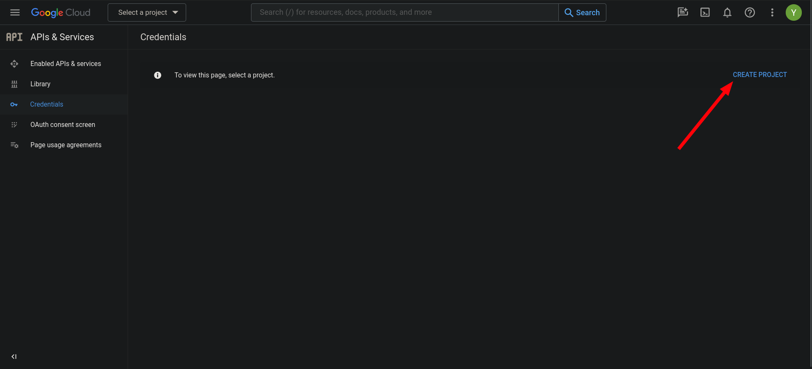
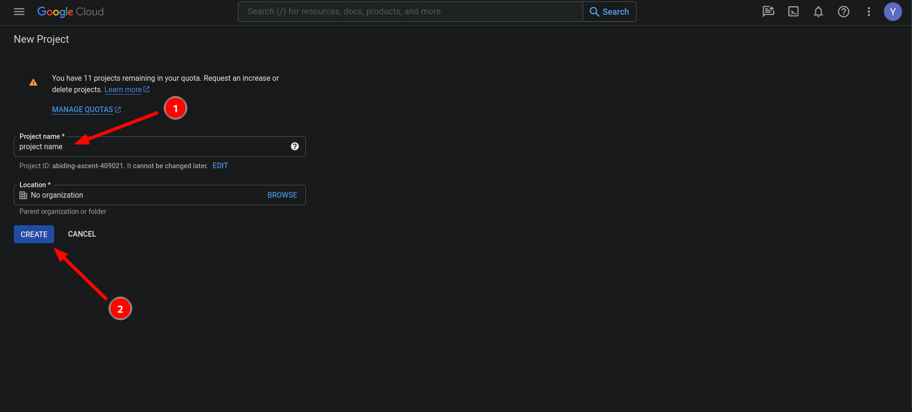
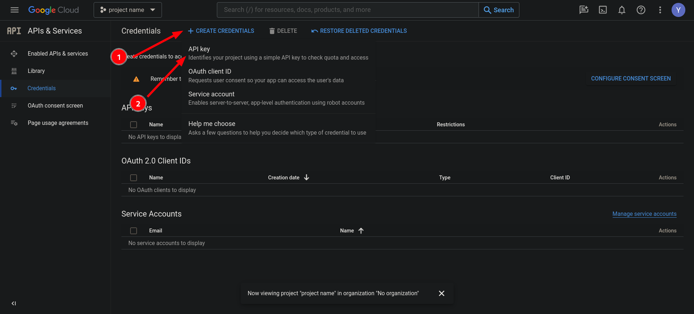
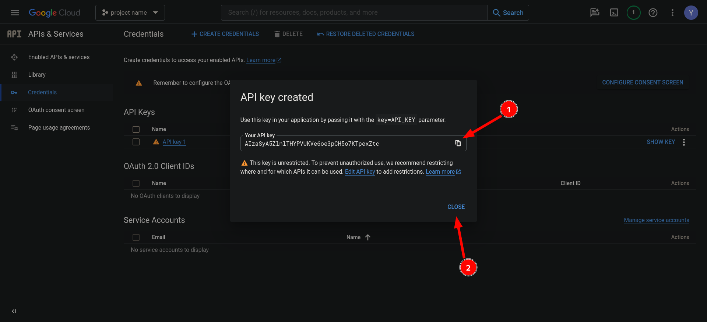
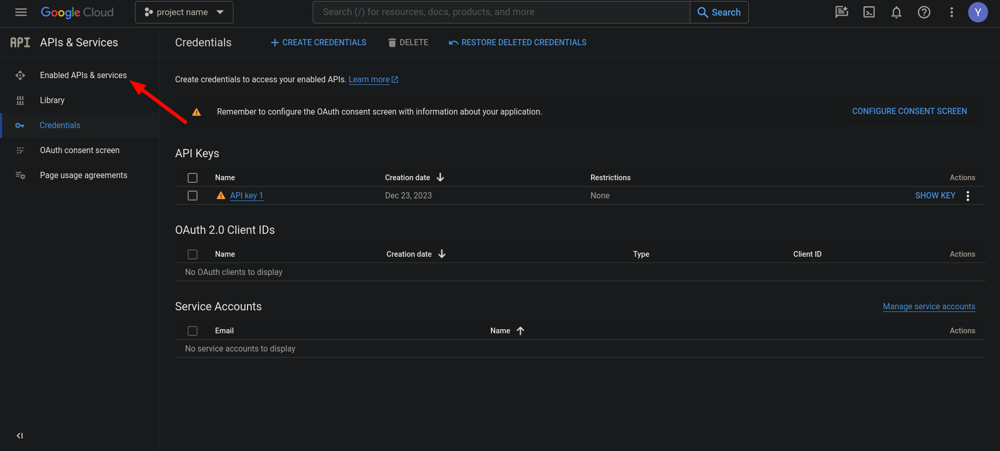
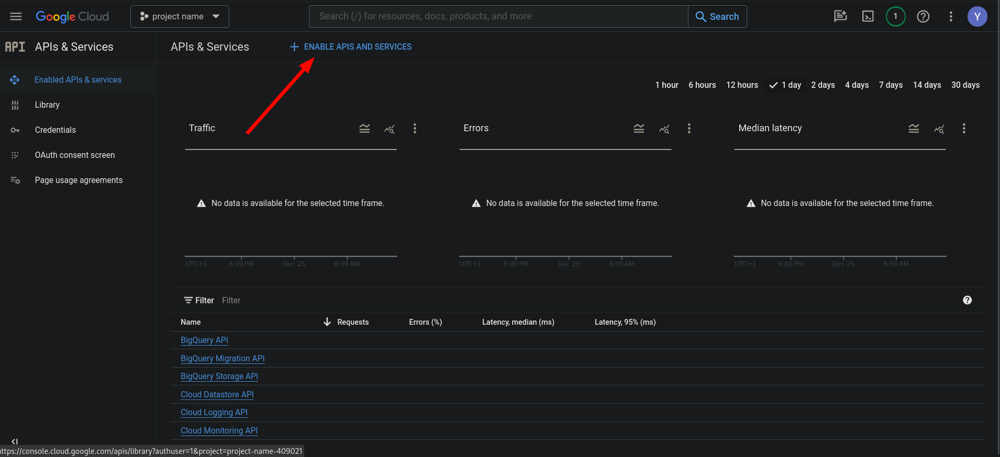
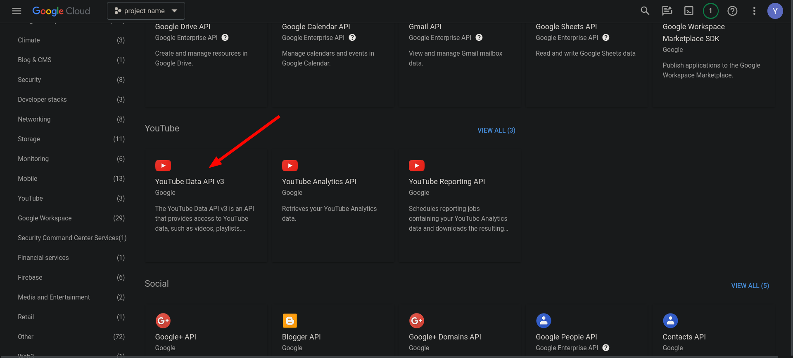
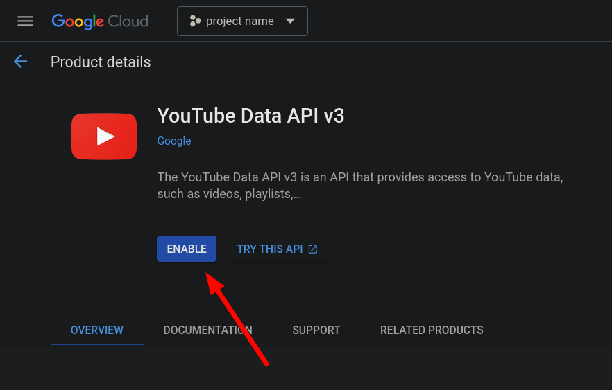

# Get YouTube API key guide

Go to [Google Cloud Console](https://console.cloud.google.com/projectselector2/apis/credentials).

## 1. Click Create Project

## 2. Enter project name and click Create

## 3. Click Create Credentials -> API key

## 4. Copy API key and close dialog window.

## 5. Click Enable APIs & services

## 6.Click Enable APIs  and services

## 7. Scroll down and click YouTube Data API v3

## 8. Click Enable

## 9. Now you can use YouTube API key.

## Great! Let's go back to main README:
[Main Readme link](..%2F..%2FREADME.md)