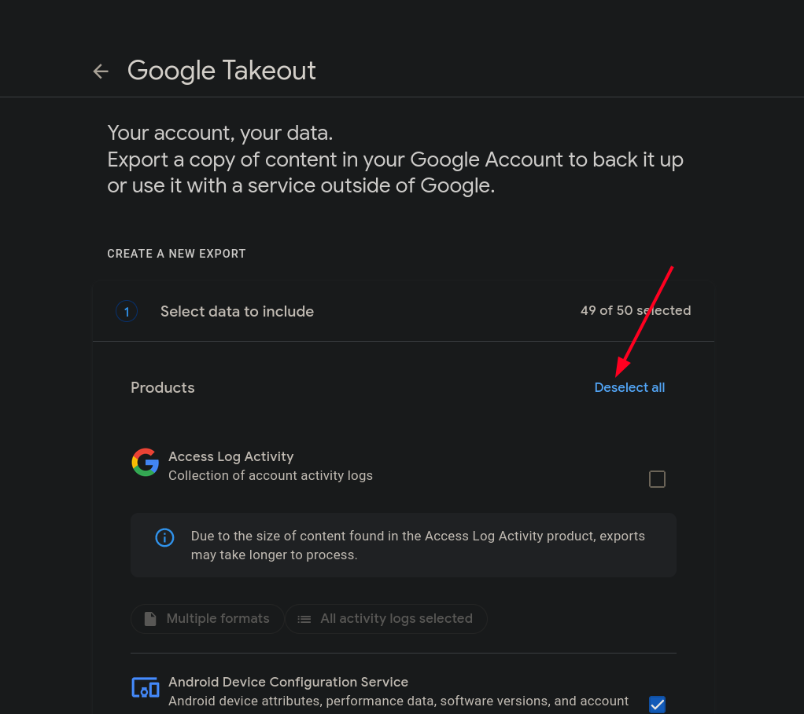
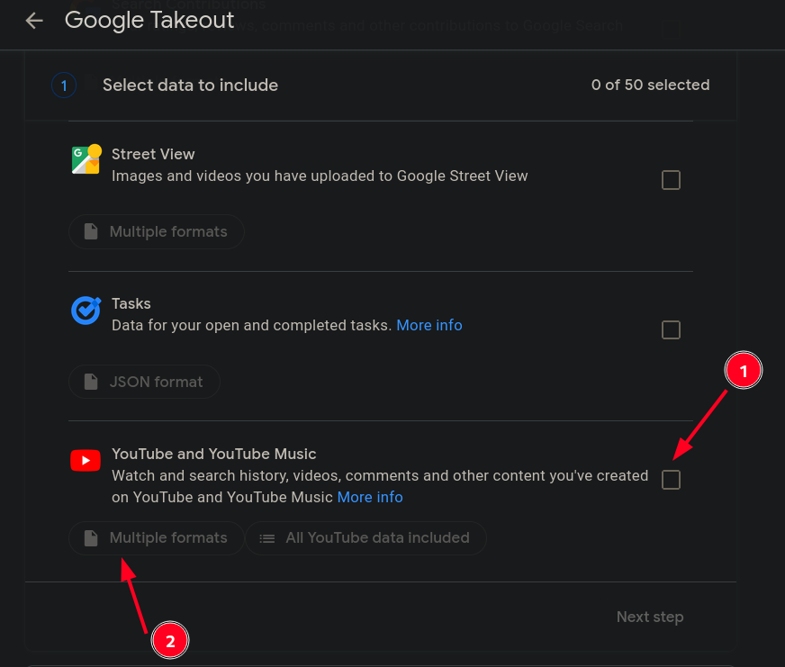
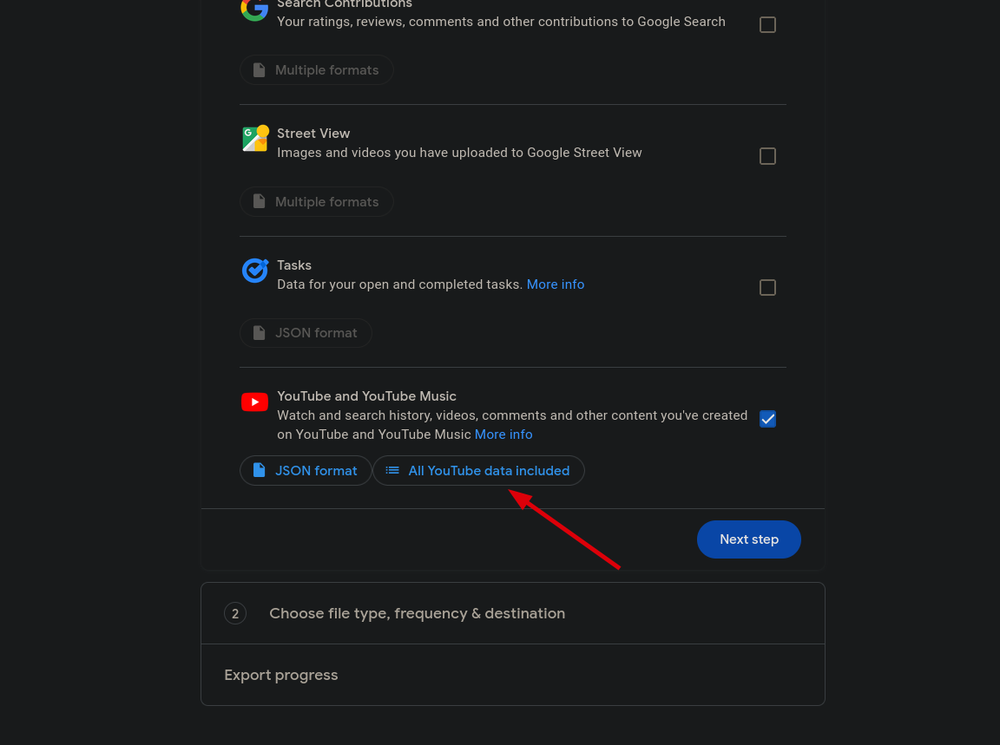
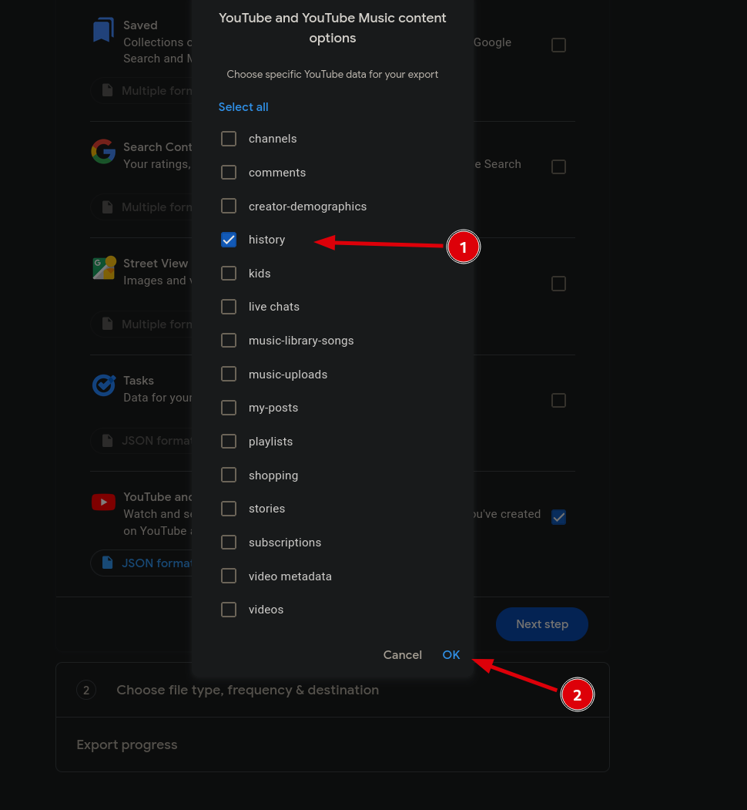
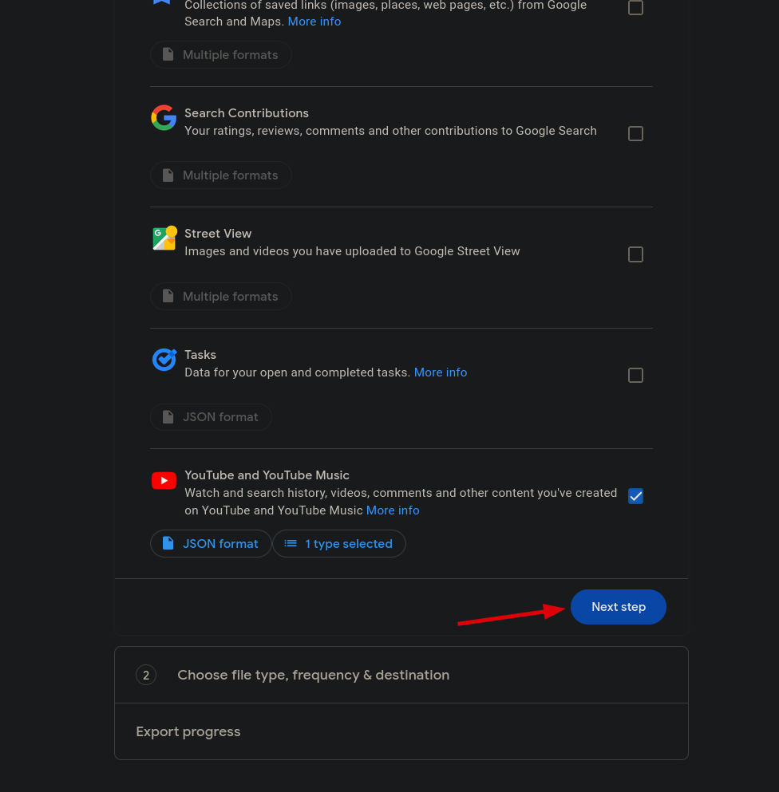

# YouTube History Export Guide

Go to [Google Takeout](https://takeout.google.com/settings/takeout).

## 1. Click Deselect all

## 2. Scroll down and select YouTube. Click Multiple formats.

## 3. Select JSON format and click OK.

## 4. Click Next step.

## 5. Click Create export.

## 6. Wait for export to complete. Make take few hours.

## Amazing! Let's go back to main README:
[Main Readme link](..%2F..%2FREADME.md)